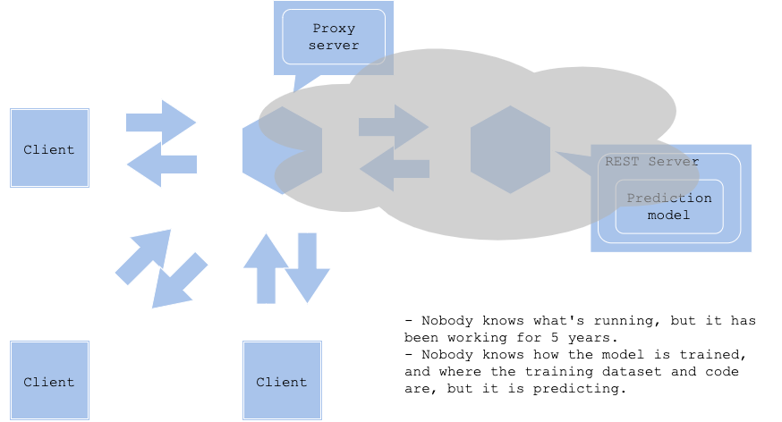

# Nobody knows pattern

## Case
- モデルを開発したエンジニア、システム開発者、運用者が不在（または退職）により、稼働しているシステムを理解している人間がいなくなる状態。
- 手動で誰のレビューもなくコードやモデル、データ、設定を変更できる状態。

## Situation
機械学習システムに限らず、稼働しているシステムが何故、どうやって動いているのか、誰も知らない状態は恐ろしいでしょう。単体で動いていて事業影響のないシステムであれば良いですが、「誰も知らない」ということは依存関係や事業影響の有無も正確に把握できていない可能性があり、停止した瞬間に事業が止まる、ということも考えられます。 
他方でプロジェクトに同じメンバーが常にアサインされ続けることはありません。個人的または組織的な事情で不在になることがあります。しかしメンバーの出入りとシステムの稼働は別物です。担当者が退職したからといって急に事業用の本番システムを停止することは考えられません。機械学習のモデルやシステムについても同様で、メンバーが不在になったとしても開発や事業を維持できるよう、複数人でモデルのロジックおよびシステム構成、コードを共有し、引き継げることが理想です。 
「誰も知らない」状態はメンバーの出入り以外でも発生します。例えば物理デバイスのログをもとに推論している機械学習システムがあるとします。工場のラインや室内温度計が物理デバイスの例になるでしょう。温度は摂氏、華氏、ケルビンで計測することができ、日本では摂氏が一般的ですが、単位を華氏に換えると範囲が大きく変わります（摂氏0°は華氏32°、摂氏100°は華氏212°）。温度計の単位を変えて、入力データの計測単位を摂氏から華氏に換える場合、推論時に摂氏華氏変換を行っていないと（≒摂氏華氏変換を検知できないと）、推論結果は大きく変わると思われます。摂氏華氏変換であれば大きな値の変化となり、異常値検知が可能かもしれません。しかしメートルとヤードの変換（1メートル＝1.09ヤード）の場合、差異が小さく済むため、もっともらしいログと推論が記録され、異常に気づかない可能性もあります。こうした物理デバイスの変換は機械学習システムを意識せず、利用者の利便性のために実施されるため、「誰も知らない」状態で推論が異常になることがあります。

## Diagram

## Pros
- 特になし。

## Cons
- 機械学習システムの運用が困難になる。
- 推論結果が異常になる。

## Work around
- システムの開発、運用を個人に依存させない。
- 入力データに計測単位を含める。

## Related design pattern
- [Prediction log pattern](./Operation-patterns/Prediction-log-pattern/design_ja.md)
- [Prediction monitoring pattern](./Operation-patterns/Prediction-monitoring-pattern/design_ja.md)
