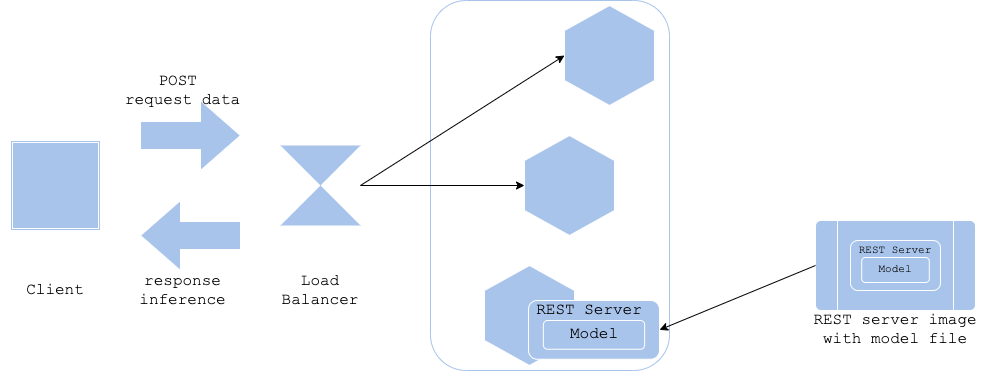

# Model-in-image pattern

## Usecase
- When you want to unify versions of service environment and prediction model.

## Architecture
While productionizing a service on a cloud platform or container became common practice, it is still an important consideration to manage and version machine learning model with its server image. It is possible to include a model file built in to the server or container image. In the model-in-image pattern, you are going to build a server or container image with the model file contained, with alighning the model training and image building in one workflow. This will make the image version and model version unique, that you will not lose version alighnment of each other. 
You will build your image after the model training completes. You will be able to deploy the prediction service with pulling and running the image on the production platform. 
A difficulty of the pattern is that the image building latency tends to get long and image size increase. Since the image building starts after the training completion, you need to make a pipeline to go through without error or recoverable. Also its deployment time will be long along with downloading an image gets long.

## Diagram

## Pros
- Uniquely identify a server image with model file version.

## Cons
- You need to define a complete pipeline of a model training and image building.
- Takes longer to build image and deploy.

## Needs consideration
- Pipeline definition.