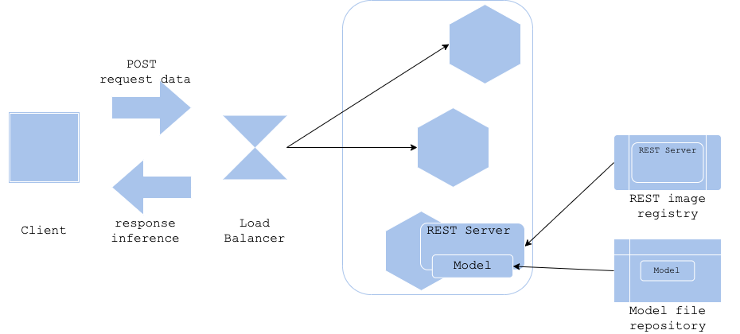

# Model load pattern

## Usecase
- When update cycle of a model is more frequent than server image update.
- When you want to reuse a server image to multiple models.

## Architecture
While productionizing a service on a cloud platform or container became common practice, it is still an important consideration to manage and version machine learning model with its server image. With building server or container image and model file separately, you may be able to separate the management of the image from the model file. In the model-load pattern, you are going to build and save the prediction server image and model file separately, that making the image size light. It is also possible, or rather responsible, to make the image for common use, to be able to reuse the image on various prediction models. The pattern is effective when your models can be dependent on a same image. 
To release a prediction service in the patter, you will first deploy the prediction server into your platform, and then download the image file as its initial task to start the prediction process. You may consider using an environmental variable to configure the model to run on the server. 
A difficulty of the pattern is to manage dependent library for the models. You are required to match the libraries versions that the model uses and the ones that is installed in the image. It will be needed to make a table of supported libraries for each image and models, thus resulting in increase of operation.

## Diagram

## Pros
- Separate model versioning and image versioning.
- Reuse of server image.
- Light image size.

## Cons
- It may take longer to start the service.
- Match supported versions of images and models.

## Needs consideration
- Dependent version management of server image and model file.