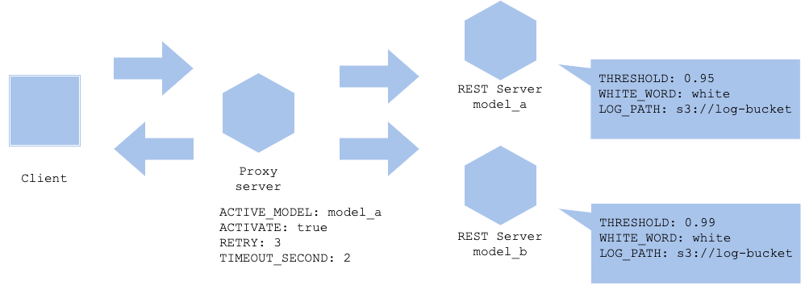

Parameter-based serving pattern

## Usecase
- 推論器を変数で制御したい場合
- ルールベースで制御が必要な推論が存在する場合

## Architecture
MLモデルは学習によってパラメータが固定されるため、一般的に学習後に個別に修正することはできません。他方でモデルの学習とビジネスロジックやシステム仕様が常に一致するとは限りません。例えば推論器が異常な推論を繰り返していてビジネスに悪影響がある場合、モデルを再学習して修正リリースするか、推論器を本番サービスから切り離す必要があります。再学習に時間を要する場合、一時的に切り離す判断も必要です。または一部のデータ集合のみ推論が異常で、他の集合は正常な場合もあります。その場合、やはり再学習するか、異常な集合のみを推論しないロジックが必要になります。本番サービスにMLモデルを組み込む場合、モデルの精度が良ければ成功するわけではなく、エッジケースやシステム的な事情でルールベースで対処が必要になることがあります。 
こうした場合に備えて、推論の停止や一部データの推論からの除外、リトライやタイムアウト等、システムの中で推論器を運用するために必要なロジックを埋め込んでおくと即時対応が可能になります。アプリケーションであれば実行コマンドで指定可能な変数を用意しておくと良いでしょう。コンテナ型のシステムであれば環境変数で指定することが一般的です。いずれにしても、どんなに高精度なMLモデルでも、すべてのエッジケースや将来発生する異常に対して正常な推論をすることは困難であるため、発生しうる異常はルールベースで制御できるようにしておくと運用が安定します。なお、すべて異常をルールベースでカバーできるわけではないため、最悪の場合は推論器への接続を停止できるよう、`ACTIVATE` 変数だけは用意しておくことを推奨します。

## Diagram

## Pros
- MLモデルが正常に推論できないエッジケースや異常値による不具合を回避することができる。

## Cons
- すべてのケースをルールベースでカバーできるわけではない。
- ルールベースによる制御が増えることによる複雑化。

## Needs consideration
- どのケースをどういうルールと変数で対応するか。