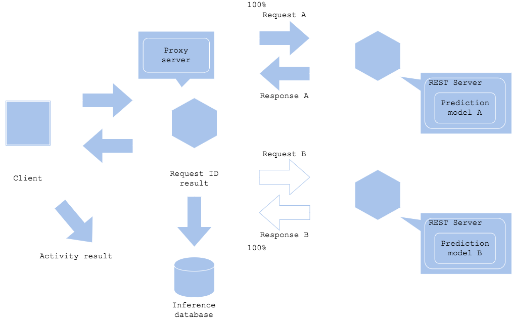

# Shadow AB test pattern

## Usecase
- To confirm the a new prediction model works with the production data.
- To verify a new prediction server can load the production access.

## Architecture
The shadow AB test pattern is an architecture to verity multiple prediction models with the production data and load. In this pattern, you will deploy multiple prediction servers, with sending requests to all the services, while the response will be only sent from the current model. The predictions of other models will not be sent to the client. The proxy server will store all the prediction results with profile to DWH. You will record prediction as well as latency without affecting client experience, to verify quality of the new model service. 
If there happens to have any issue with the new model, the prediction service will not be productionalized, and eliminated from the AB testing. You need to consider the term of testing. If the service has seasonal effect, you may need to run longer term, while if the service is used everyday in similar manner, the performance can be concluded in a few week. There may be a chance that you may find the result in shorter term. It is important to decide go or no go based on the effect of the new model replacing the current one. 
In contrast to the online AB test pattern, the shadow AB test pattern will allow you to compare the current and new models with less risk. On the other hand, since the pattern will not send the new model prediction to the client, it is difficult to measure its business impact. It is recommended to apply the online AB testing pattern once the model goes through the shadow AB test pattern.

## Diagram

## Pros
- You can verity the new model performance without affecting the production service.
- It is possible to record multiple predictions.

## Cons
- Additional cost.

## Needs consideration
- Evaluation and decision policy of go or no go for the new model.