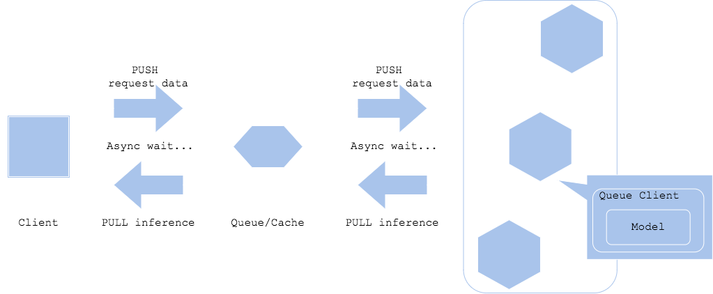
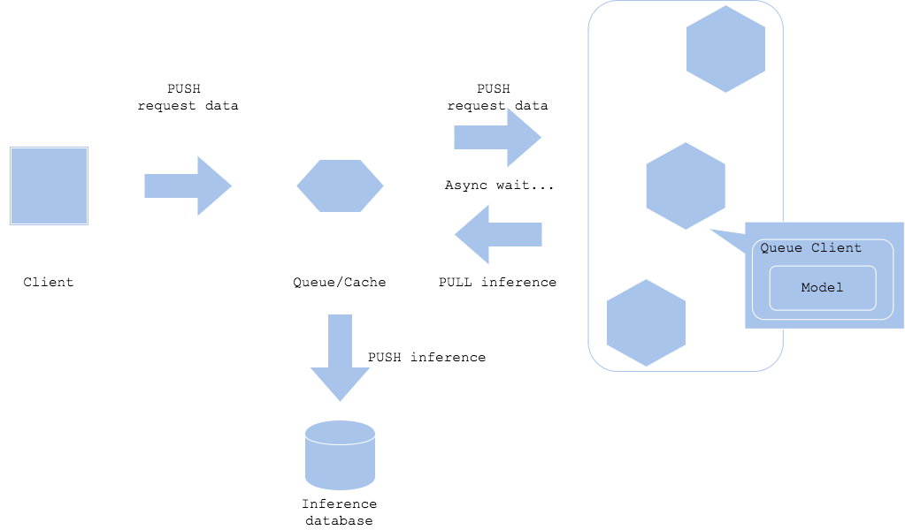

# Asynchronous pattern

## Usecase
- 直後の動作が推論結果に依存しないワークフローのとき
- 呼び出し元のクライアントと推論結果の出力先を分離するとき

## Architecture
非同期パターンはリクエストと推論の中間にキューやキャッシュを配置することで、推論リクエストと推論結果の取得を非同期にします。リクエストと推論を切り離すことにより、クライアントのワークフローで推論時間を待つ必要がなくなります。クライアントで推論結果を得るには、クライアント側でキューをポーリングしてPullする必要があります。`Diagram2`のように推論のリクエスト元と出力先が違う場合、非同期パターンにすることによってクライアントは推論を待たずに処理を続行することが可能になります。 
加えて、`Diagram1`、`Diagram2`のいずれにおいても、推論結果は推論器からクライアントや出力先に直接Pushすることも可能ですが、推論器側が推論結果を返却するためのコネクションが必要になりシステムが複雑になるため、検討が必要です。

## Diagram
### Diagram1

### Diagram2

## Pros
- クライアントと推論を切り離すことが可能。
- 推論の待機時間が長い場合でも、クライアントに悪影響が出ることが少ない。

## Cons
- キューやキャッシュが必要になる。
- リアルタイムな処理には向いていない。

## Needs consideration
- 推論のトリガーを検討する必要がある。
  - キューで実装する場合：FIFOで推論。
  - キャッシュで実装する場合：キャッシュの有無で推論。
  - PubSubで実装する場合：サブスクライブによって推論。
- 推論エラー時の対応方法を検討する必要がある。
  - リトライする場合、推論サーバ内でリトライするか、キュー/キャッシュに戻すか。
  - データやプログラムの誤りで推論エラーになる場合、そのリクエストを停止または破棄しない限り、リトライ↔エラーが続くことがある。
- 厳密な順番は保証されないため、入力やイベントに対する推論順が重要なワークフローの場合は検討が必要。