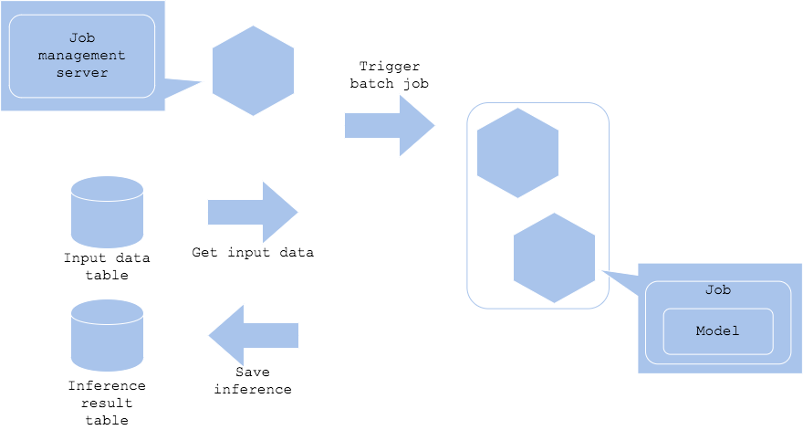

# Batch pattern

## Usecase
- If you don't have to get prediction result in real-time or almost real-time.
- If you want to run prediction on a bulk of data.
- Running prediction is schedulable; hourly, daily, weekly, monthly.

## Architecture
If you don't have to run the prediction real-time, you may choose the batch pattern to run the prediction regularly. You can schedule a batch prediction to a bulk of data regularly, such as daily, and store the results. Of course it can be hourly or monthly depending on your usecase. The pattern requires job management server to trigger the batch job. The server will launch the job by your defined rule. The prediction server will be deployed with the batch job launch. If you are using cloud service or Kubernetes, starting and deleting the server based on the job will enable your to cost reduction.

## Diagram

## Pros
- You can manage server resource flexibly.
- You may rerun the job in case of error.

## Cons
- You need a job management server.

## Needs consideration
- You will need to consider the bulk, or range, of dataset to predict in one job.
- If you have time limitation to get the prediction results, you need to consider batch job schedule and server resource. If it is nightly batch, it is often case that you have to finish the job by next morning.
- How to rerun the job in case of failure:
  - Retry all: rerun the whole prediction of a batch. Used when a prediction or data has dependency on others.
  - Partial retry: rerun on the failed dataset. Used when there is no dependency.
  - No retry: run prediction on the failed dataset on the next batch. Used when there is no strict time limitation.
- If the batch timeframe is long, like once per month or once per year, it is suggested to monitor, or run temporarily, of the batch execution, for the model or system may be outdated.