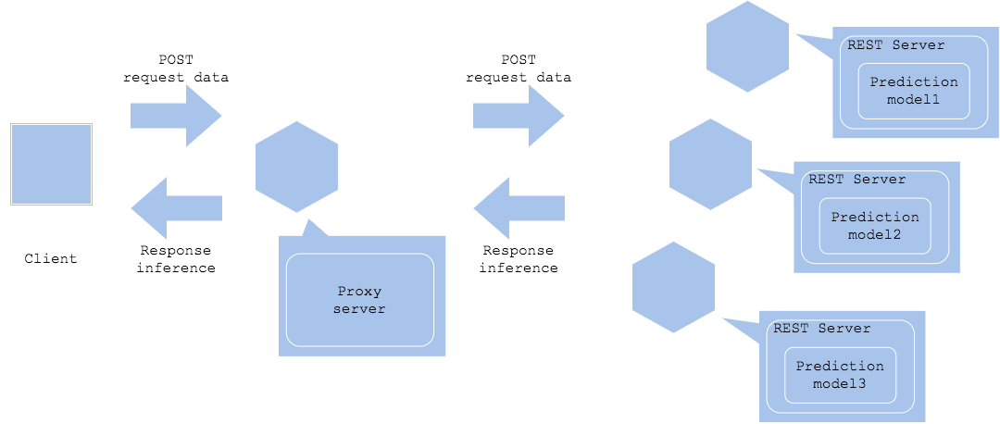
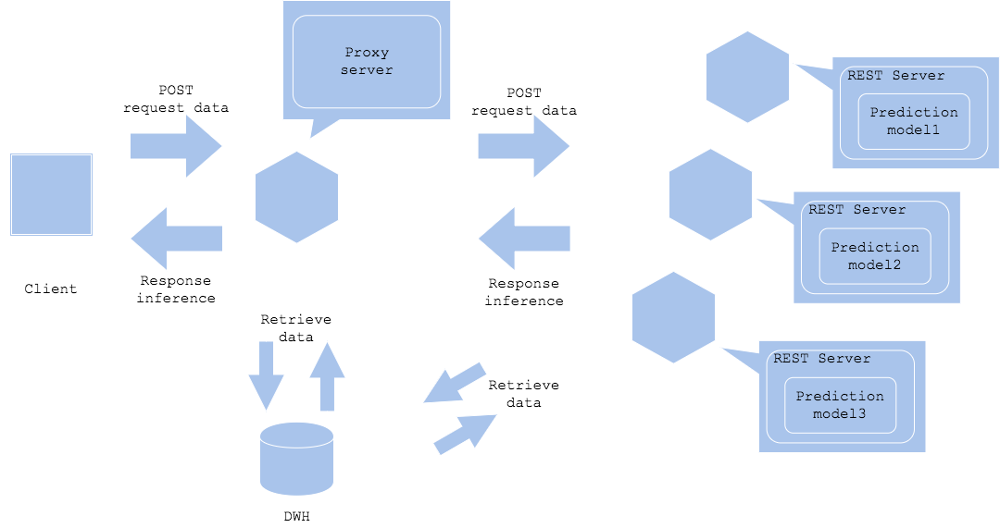
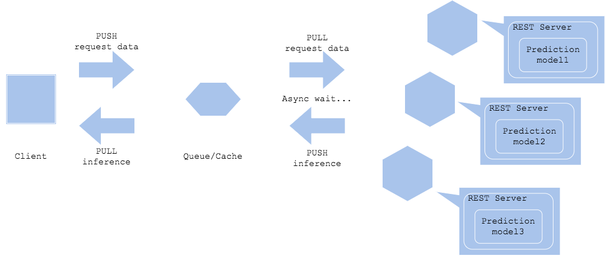

# Microservice horizontal pattern

## Usecase
- When the workflow can execute multiple predictions parallelly.
- When you want to integrate prediction results at last.
- Required to run several predictions to one request

## Architecture
The microservice horizontal pattern enables you to run multiple independent models parallelly. You can send one request to the models at once to acquire multiple predictions, or an integrated prediciton. It is possible to respond with aggregated result, or just a specific prediction. 
You can decide to run on synchronous or asynchronous depending on your usecase. If you choose to do synchronously, it may be needed to respond the result after aggregated predictions from all the models. If asynchronous, then you can trigger the next action immediately once you get a specific prediction (`Asynchronized horizontal`). 
You may place a proxy in between client and prediction services. You may expect the proxy to control the data retrieval and prediction order away from the client. You may let the proxy or each predictors to do additional data retrieval (`Synchronized horizontal with data retrieval`). An advantage of proxy to get data is that it will decrease the number of requests to DWH or storage to reduce overhead, while the latter will let you control the data structure depending on each prediction model, that allows you to make complex workflow.

## Diagram
### Synchronized horizontal

### Synchronized horizontal with data retrieval

### Asynchronized horizontal

## Pros
- You can tune resource usage independently and isolate failure.
- You may develop model and system without having dependency on other models.

## Cons
- The system may become complex.
- For synchronous usecase, the slowest inference becomes bottleneck.
- For asynchronous usecase, you have to let the postprocess to manage time lag between prediction latencies.

## Needs consideration
- Synchronous or asynchronous.
- How to manage slow model for synchronous: timeout or wait.
- How to manage time lag for asynchronous.