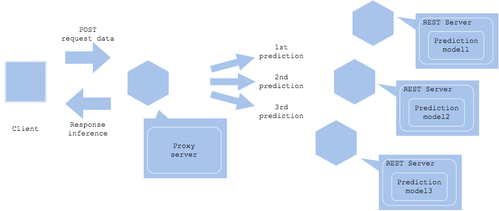
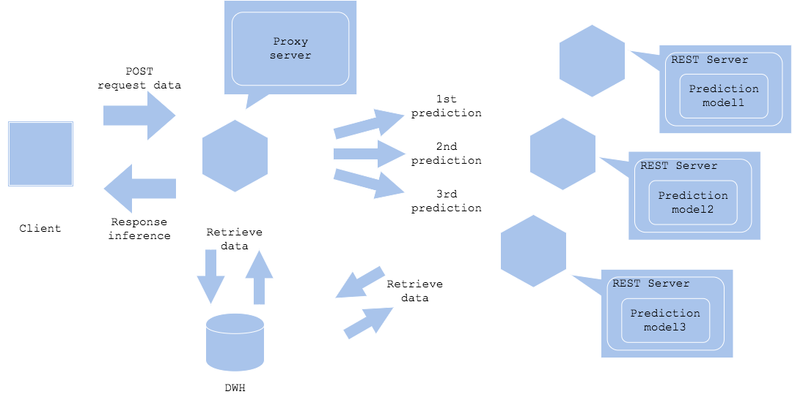

# Microservice vertical pattern

## Usecase
- When you need to run several inferences in order
- When you have several inferences, and they have dependencies

## Architecture
The microservice vertical pattern allows you to run multiple model in order. The pattern deploys prediction models in separate servers or containers as service. You execute prediction request from top to bottom synchronously, and gather the results to respond to the client. If there is dependencies of order for one another, the microservice vertical pattern is a good choice. It also allows you to separate maintenance lifecycle as well as fault isolation for deploying the servers independently. 
You may place a proxy in between client and prediction services. You may expect the proxy to control the data retrieval and prediction order away from the client. You may let the proxy or each predictors to do additional data retrieval (`Diagram2`). An advantage of proxy to get data is that it will decrease the number of requests to DWH or storage to reduce overhead, while the latter will let you control the data structure depending on each prediction model, that allows you to make complex workflow.

## Diagram
### Diagram1

### Diagram2

## Pros
- You may run multiple predictions in order.
- It is possible to select next prediction service depending on the former prediction.
- You may make the resource usage efficient, independent in server and code, and isolate failure.

## Cons
- Since the predictions run synchronous order, it will require higher latency.
- A former prediction latency may be bottleneck.
- Complex system structure and workflow.
- 
## Needs consideration
- You may need to consider concrete performance tuning to meet required service level.
- The system structure will become complex. It is better to try to make the interfaces and servers common.