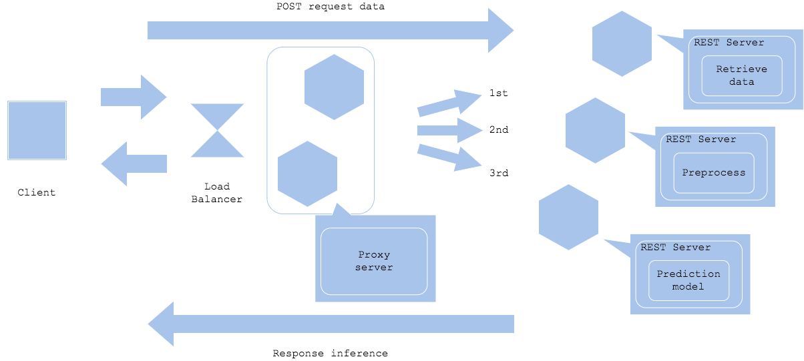

# Preprocess-prediction pattern

## Usecase
- When you have different code-base, library or resource load requirements for preprocess and prediction.
- When you want to separate preprocess with prediction to divide issue in each resource to improve availability.

## Architecture
There are cases when the requirements for preprocess and the one for prediction are different. Usually the preprocess runs normalization or standardization for numericals, one-hot encoding for categories, vocab filtering for NLP, resizing for image, and so forth, and they can be pretrained or can be rule-based. On the other hand, the prediction implies pretrained and built, or binalized, model file that can take input to return inference. The preprocess maybe just defined in Python, and the prediction model may be built with Tensorflow or ONNX in binary. These differences enables to build separate servers or containers to optimize development and operation of each resource. 
Since you divide preprocess and prediction model into separate resources, you need to consider tuning, network connection, versioning for each of them. It makes the system complex than the [web single pattern](../Web-single-pattern/design_en.md), while the preprocess-prediction pattern enables you to use the serving resource efficient, as well as independent development and fault isolation. There are many cases to apply the pattern in case of using deep learning for inference. 
The `diagram2` shows deploying a proxy in front of the preprocess and prediction, to make them as microservices. In this case, the proxy will mediate data retrieval, preprocess and prediction services. It will allow you to develop those resources separately with independent library, language and infrastructure. However, it will add components to manage that requires you to understand all the components to troubleshoot in case of incident.

## Diagram
### Simple prep-pred pattern

### Microservice prep-pred pattern

## Pros
- Able to use resource efficiently with fault isolation.
- Flexibility in resource usage and scalability.
- Able to select library and language versions for each component.

## Cons
- Increases operation cost with complexity in resources.
- Network connection in between preprocess and prediction may become bottleneck.

## Needs consideration
- Since it is impossible to train a whole model, including preprocess and prediction, independently, you still have to tune parameters in one training.
  - If you happen to develop preprocess and prediction separately, there may not cause trouble as system, though may cause incorrectness in prediction.
- You have to tune resources separately.
