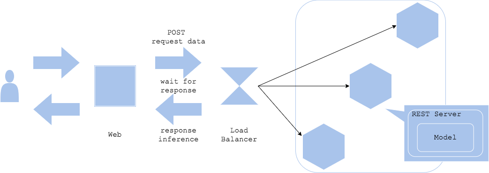

# Synchronous pattern

## Usecase
- When you have to get the inference to proceed to the next step.
- When the workflow depends on the inference result.

## Architecture
The synchronous pattern is used to run prediction synchronously. It blocks the process until the prediction finishes. If you develop the inference server with REST or GRPC, it often becomes the synchronous pattern. This is one of the easiest patterns to use for you can consider its workflow in simple step-by-step.

## Diagram

## Pros
- Easy to manage with its simplicity.
- Service workflow becomes simple for the process won't proceed until the prediction completes.

## Cons
- The prediction speed becomes performance bottleneck.
- You need to consider a work around for not making user experience getting worse for prediction latency.

## Needs consideration
- Work around for not making user experience getting worse for prediction latency.
- Needs timeout if the latency is too long.