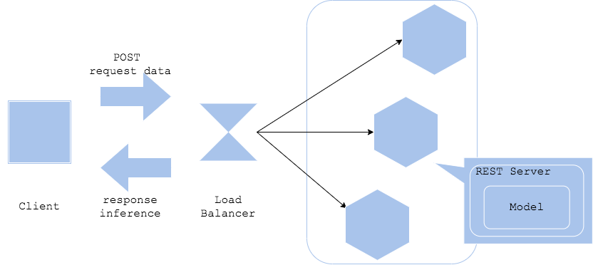

# Web single pattern

## Usecase
- When you want to quickly release the predictor in the simplest architecture.

## Architecture
The web single pattern is an architecture that packs all the artifacts for prediction model in a web server. Since the single server REST (or GRPC) interface, preprocess, and trained model in one place, you can create and deploy as a simple predictor. 
If you want to deploy multiple replications, you need to deploy with a load balancer or proxy. In case you are using GRPC for the interface, you need to consider client side load balancing or layer-7 load balancer. 
To build your model into the web server, you can apply either [model-in-image pattern](./../../Operation-patterns/Model-in-image-pattern/design_en.md) or [model-load pattern](./../../Operation-patterns/Model-load-pattern/design_en.md).

## Diagram

## Pros
- Able to use one programming language, such as Python, for the web server, preprocess and inference.
- Easy to manage with its simplicity.
- Troubleshooting will not be complex.
- Suggested to start with deploying in the web single pattern to deploy a model in synchronous system.

## Cons
- Since all components are packed in a server or docker image, applying a small patch will require whole update.

## Needs consideration
- Update and maintenance procedure for each component.
- Scale change management of the web server.